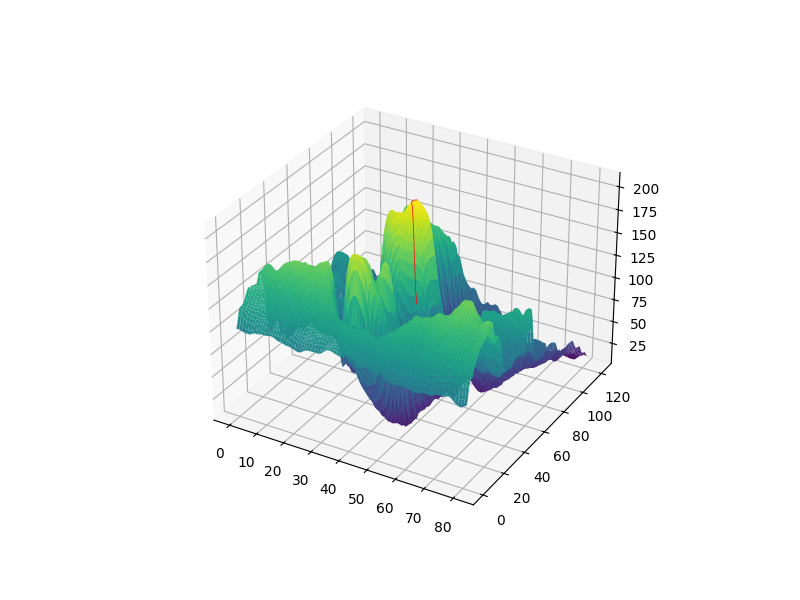
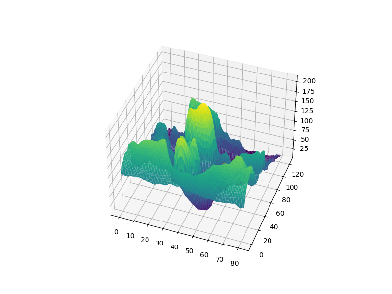
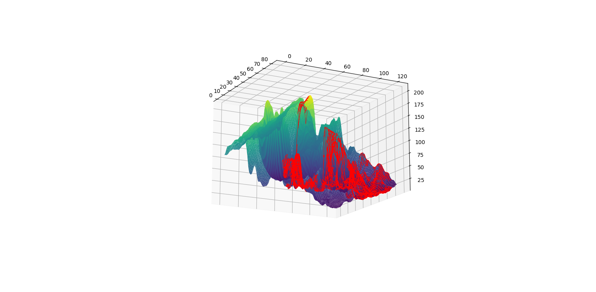

# ⛰️ Local Search Strategies for 3D Surface Optimization

Dự án triển khai các chiến lược tìm kiếm cục bộ (Local Search) để tối ưu hóa trên mặt cong không gian 3D. 
## 🖼️ Kết quả thực nghiệm (Experimental Results)

Dưới đây là trực quan hóa đường đi của 3 thuật toán trên mặt cong 3D:

### 1. Random Restart Hill-Climbing

*Thuật toán chạy nhiều lần từ các điểm ngẫu nhiên để tìm đỉnh cao nhất.*

### 2. Local Beam Search

*Duy trì song song k trạng thái để khám phá nhiều vùng không gian cùng lúc.*

### 3. Simulated Annealing Search

*Sử dụng cơ chế giảm nhiệt độ để vượt qua các cực trị cục bộ.*

---

## 📋 Mô hình hóa bài toán (Problem Modeling)
Bài toán được xây dựng thông qua lớp `Problem` trong tệp `problem.py`:
* **Trạng thái (State)**: Mỗi trạng thái là một bộ tọa độ $(x, y, z)$.
* **Giá trị đánh giá**: Giá trị $z$ tương ứng với giá trị evaluation của trạng thái.
* **Trực quan hóa**: Sử dụng hàm `show()` để vẽ mặt cong và `draw_path()` để vẽ đường đi.

## 🧠 Các chiến lược tìm kiếm
Dự án triển khai lớp `LocalSearchStrategy` trong `search.py` với 3 phương thức chính:
* **random_restart_hill_climbing(problem, num_trial)**: Trả về danh sách bộ (x, y, z) từ trạng thái bắt đầu đến kết quả.
* **simulated_annealing_search(problem, schedule)**: Tìm kiếm dựa trên hàm lập lịch nhiệt độ.
* **local_beam_search(problem, k)**: Duy trì $k$ trạng thái và trả về một đường đi duy nhất tới kết quả tốt nhất.

## 📂 Cấu trúc mã nguồn
* `problem.py`: Định nghĩa lớp Problem và các hàm xử lý dữ liệu, vẽ 3D.
* `search.py`: Cài đặt logic của 3 thuật toán tìm kiếm cục bộ.
* `test.py`: Script điều khiển chính để vận hành và thực hiện các thuật toán.
* `viz3d.py`: Thư viện hỗ trợ đọc dữ liệu và xử lý đồ họa 3D.

## 🚀 Hướng dẫn thực thi
1. Chạy tệp kiểm thử:
   ```bash
   python test.py

## Tác giả: Nguyễn Minh Nhựt